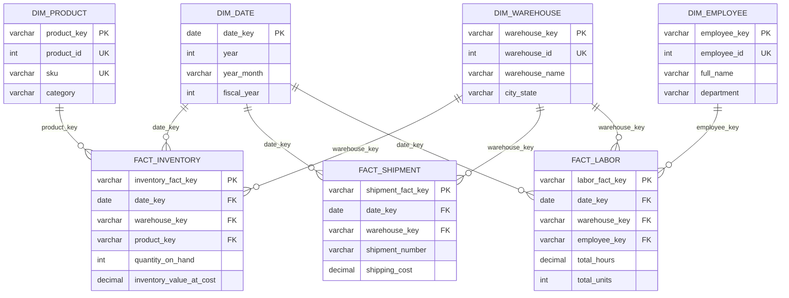
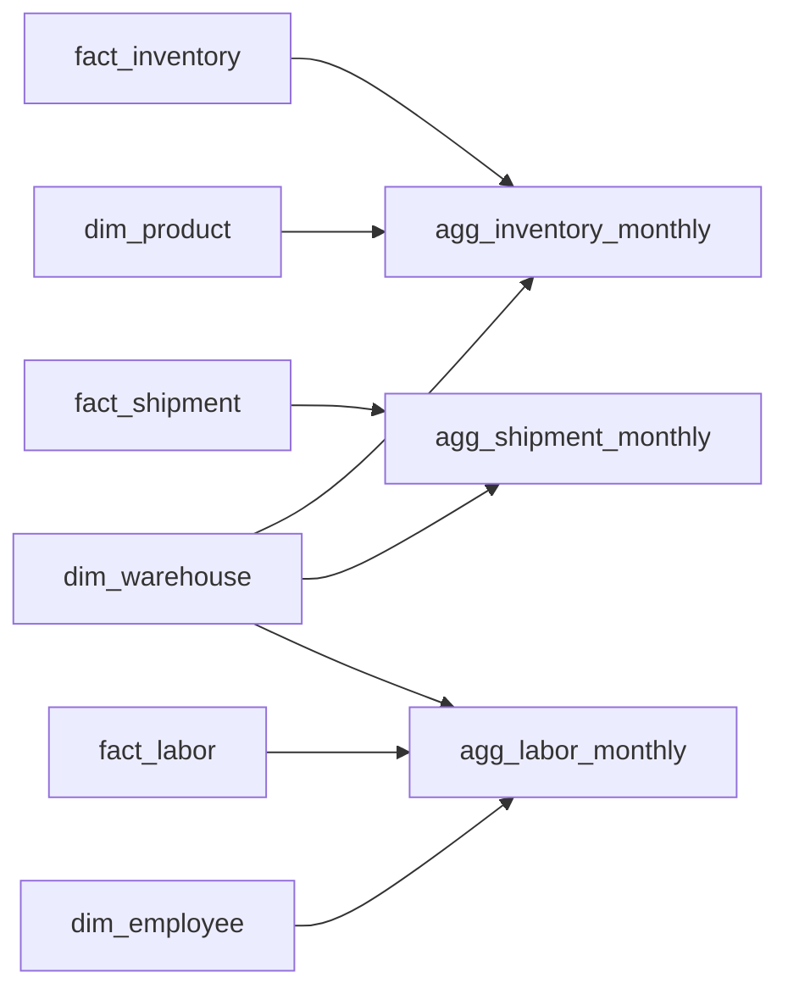

# Star Schema ERD — Warehouse Operations Analytics

## Logical model

## Fact grains

| Fact | Grain | Primary identifier | Dimensions |
|---|---|---|---|
| `mart.fact_inventory` | One product × warehouse × snapshot date | `inventory_fact_key` | Date, Warehouse, Product |
| `mart.fact_shipment` | One shipment | `shipment_fact_key` | Ship Date, Warehouse |
| `mart.fact_labor` | One employee × activity type × activity date | `labor_fact_key` | Activity Date, Warehouse, Employee |

## Relationship rules

- All relationships are one-to-many from dimension to fact and use single-direction filtering.
- Surrogate keys are generated with `dbt_utils.generate_surrogate_key`; natural IDs remain available for traceability.
- `fact_shipment` intentionally has no product relationship. Shipment items are aggregated to shipment grain before loading the fact.
- `dim_date` spans 2024-01-01 through 2027-12-31 and contains calendar and July-start fiscal attributes.
- Facts retain selected degenerate dimensions such as shipment status, carrier, activity type, and stock status.

## Aggregate layer

| Aggregate | Grain | Intended use |
|---|---|---|
| `agg_inventory_monthly` | Month × warehouse × product | Inventory value and stock trends |
| `agg_shipment_monthly` | Month × warehouse × shipment type × carrier | Shipment volume, service, and cost trends |
| `agg_labor_monthly` | Month × warehouse × employee × activity type | Labor cost and productivity trends |

## Physical pipeline

`raw source tables → staging views → ephemeral intermediate models → mart dimensions/facts → monthly aggregates → Power BI/API`

Referential integrity is enforced where possible in SQL Server and checked independently by `scripts/validate_data.py` and dbt singular tests.

